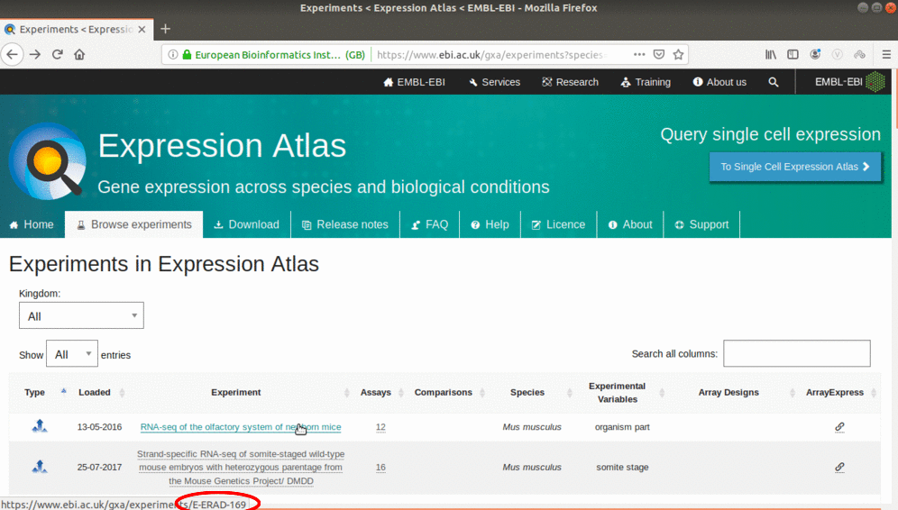

# Batch effect correction in Baseline experiments from Expression Atlas

The pipeline to correct batch effect between Baseline experiments is described in details below. The functions are written in the file `pipeline.R`.

## Installing the dependencies (first use)
To run the following functions, you will need some packages that can be installed using these commands in R :
```r
install.packages(c('magrittr','stringr','purrr','ggplot2','igraph','gtools'))
if (!requireNamespace("BiocManager", quietly = TRUE))
  install.packages("BiocManager")
BiocManager::install('sva')
BiocManager::install('RUVSeq')
BiocManager::install('batchelor')
```

## Loading data in R
If the data files are already on your computer, you can use this step. If you want to download data from Expression Atlas, skip this part and go directly to "Downloading data from Expression Atlas".

- Put the data files in `.Rdata` format in a directory containing only them. (The R objects contained in those files must be of class `SimpleList` with a `$rnaseq` slot which is a `SummarizedExperiment` object containing the data.)
- Load all the experiments in a list using the function `load_experiments` : 

```r
experiments <- load_experiments('directory_path')
```

## Downloading data from Expression Atlas
If you want to use data from Expression Atlas that can be downloaded in `.Rdata` format, you can use the function `download_experiments_from_ExpressionAtlas` in this way :

```r
experiments <- download_experiments_from_ExpressionAtlas('E-ERAD-169','E-GEOD-73175','E-MTAB-2801')
```



This downloads the experiments in a new directory called "experiments" in your working directory and loads all the experiments in R within a list, using `load_experiments` function.

## Removing the isolated experiments
To correct batch effect, one needs to take the biological characteristics of the samples into account (organism part in our example). If no sample of an experiment shares biological characteristics with samples from other batches, it is not possible to correct batch effect with these batches since one cannot distinguish the biological difference from the artifact. The function `remove_isolated_experiments` removes the isolated experiments and plots graphs of intersections between the experiments before and after removal.

```r
experiments %<>% remove_isolated_experiments('organism_part')
```

WARNING : this function only removes the isolated experiments. Although it is still possible that two or more unconnected groups of experiments remain, within which the experiments are connected. In this case, batch effect correction is not possible neither and one has to choose a group of experiments manually.

## Merging experiments in a single dataset
The function `merge_experiments` merges all the experiments in the list in a single `SummarizedExperiment` object and doesn't perform any correction. This function has two additional arguments `log` and `filter` (set to `TRUE` by default).
- The `log` argument determines whether to perform log transformation on the data (recommended).
- The `filter` argument determines whether to filter genes for which all the samples of a batch have zero-counts. This is necessary to run `ComBat` but it can be set to `FALSE` for the other correction methods.

```r
experiments %<>% merge_experiments
#OR
experiments %<>% merge_experiments(log=TRUE,filter=FALSE)
#or any other settings
```

## Correcting batch effect
This is the most important step. The function `correct_batch_effect` takes three or four arguments (depending on the choice of the correction algorithm).
- `experiment` which is the merged dataset obtained at previous step
- `model` which is a R formula mentioning the biological factor to take into account during correction (still organism part in our example).
- `method` which can be `'ComBat'`, `'RUV'` or `'MNN'` that use respectively the functions `ComBat` from package `sva`, `RUVs` from `RUVSeq` and `mnnCorrect` from `batchelor`
- `k` which is an argument for `RUV` and `MNN`. In `RUV`, it denotes the "number of factors of unwanted variation to remove" while in `MNN`, it denotes the number of nearest neighbours to consider (kNN) (see documentation of these packages for more information).

```r
experiments %<>% correct_batch_effect(model = ~organism_part, method = 'ComBat')
```